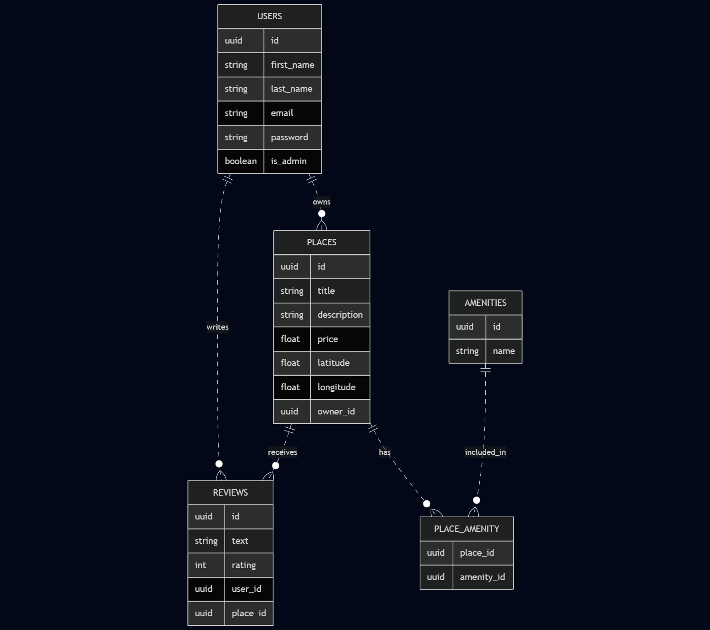

# README
# HBnB Project

HBnB is a modular web application inspired by Airbnb, allowing **users** to manage **places**, **amenities**, and **reviews**. This project demonstrates a full-stack architecture with a clear separation of concerns between **data models**, **business logic**, **persistence**, and **RESTful API**.

---

## 📁 Project Structure Overview

```
hbnb/
├── app/
│   ├── __init__.py
│   ├── api/
│   │   ├── __init__.py
│   │   ├── v1/
│   │   │   ├── __init__.py
│   │   │   ├── users.py
│   │   │   ├── places.py
│   │   │   ├── reviews.py
│   │   │   ├── amenities.py
│   ├── models/
│   │   ├── __init__.py
│   │   ├── user.py
│   │   ├── place.py
│   │   ├── review.py
│   │   ├── amenity.py
│   ├── services/
│   │   ├── __init__.py
│   │   ├── facade.py
│   ├── persistence/
│   │   ├── __init__.py
│   │   ├── repository.py
├── run.py
├── config.py
├── requirements.txt
├── README.md
```

---

## 🛠️ Setup Instructions

```bash
# 1. Clone the repo
$ git clone <your-repo-url>
$ cd hbnb

# 2. Create and activate virtual environment
$ python3 -m venv venv
$ source venv/bin/activate

# 3. Install dependencies
$ pip install -r requirements.txt

# 4. Run the app
$ python run.py
```

Access the API at: `http://localhost:5000/api/v1/`

---

## ⚙️ Business Logic Layer (Entities)

All entities inherit from `BaseModel`, which handles common logic:

- Unique **UUID** as `id`
- **Timestamps**: `created_at`, `updated_at`
- `save()` method to **update** timestamps

### 👤 User

```python
User(
    first_name="Victoire",
    last_name="Clem",
    email="victoire.clem@exemple.com",
    is_admin=False
)
```

- **Fields**: `id`, `first_name`, `last_name`, `email`, `is_admin`, `created_at`, `updated_at`

### 🏡 Place

```python
Place(
    title="Sea View Flat",
    description="Nice and cozy",
    price=90.0,
    latitude=43.6,
    longitude=1.43,
    owner=user_instance
)
```

- **Fields**: `id`, `title`, `description`, `price`, `latitude`, `longitude`, `owner`, `amenities`, `created_at`, `updated_at`

### 📝 Review

```python
Review(
    text="Great stay!",
    rating=5,
    user=user_instance,
    place=place_instance
)
```

- **Fields**: `id`, `text`, `rating`, `user`, `place`, `created_at`, `updated_at`

### 🛏️ Amenity

```python
Amenity(name="Wi-Fi")
```

- **Fields**: `id`, `name`, `created_at`, `updated_at`

---

## 🤝 Entity Relationships

- A **User** can own multiple **Places**
- A **Place** can have multiple **Reviews** and **Amenities**
- A **Review** belongs to one **User** and one **Place**

---

## 🌐 API Endpoints Overview

Each endpoint follows RESTful conventions. All responses are JSON.

### Users

- `POST /api/v1/users/` — Create a user
- `GET /api/v1/users/<user_id>` — Get a user by ID
- `GET /api/v1/users/` — List all users
- `PUT /api/v1/users/<user_id>` — Update user info

### Places

- `POST /api/v1/places/` — Create a place
- `GET /api/v1/places/` — List all places
- `GET /api/v1/places/<place_id>` — Get place details (with owner, amenities, reviews)
- `PUT /api/v1/places/<place_id>` — Update place

### Reviews

- `POST /api/v1/reviews/` — Add a review
- `GET /api/v1/reviews/` — List all reviews
- `GET /api/v1/reviews/<review_id>` — Get review
- `PUT /api/v1/reviews/<review_id>` — Update review
- `DELETE /api/v1/reviews/<review_id>` — Delete review
- `GET /api/v1/places/<place_id>/reviews` — Get all reviews for a place

### Amenities

- `POST /api/v1/amenities/` — Create amenity
- `GET /api/v1/amenities/` — List amenities
- `GET /api/v1/amenities/<amenity_id>` — Get amenity
- `PUT /api/v1/amenities/<amenity_id>` — Update amenity

---

## 🧬 UUIDs: Why?

UUIDs (Universally Unique Identifiers) are used as primary keys for all objects to:

- Ensure **global uniqueness** across systems
- Prevent enumeration attacks
- Support **distributed architecture** without ID conflicts

Example:

```python
self.id = str(uuid.uuid4())
```

---

## 🔐 Authentication and Token Handling

The application uses **JWT (JSON Web Tokens)** for securing protected routes.

- On login, a token is returned:
  ```json
  {
    "access_token": "<your-token>"
  }
  ```
- This token must be passed in the `Authorization` header as:
  ```
  Authorization: Bearer <your-token>
  ```
- The token stores the user ID and admin status, used to control access on protected endpoints.

---

## 👮‍♂️ Admin Role

Users have an `is_admin` boolean flag.

- Admins can:
  - Edit or delete any place or review.
  - Access all secured endpoints.
- Non-admins:
  - Can only modify their own content (e.g., their places, reviews).

Admin privileges are verified with:
```python
is_admin = get_jwt().get("is_admin", False)
```

---

## 🗃️ Database Management

- Uses **SQLAlchemy** ORM with SQLite for development.
- Tables are mapped directly via models:
  - `User`, `Place`, `Review`, `Amenity`
- Relations:
  - One-to-many: User → Places, User → Reviews, Place → Reviews,
  - Many-to-many: Place ↔ Amenities via `place_amenity` table

To initialize or reset the database:
```bash
flask shell
>>> from app.extensions import db
>>> db.create_all()
```

---

## 📊 Entity-Relationship Diagram (ERD)



### 📌 Key Relationships

- **A User**:
  - can own multiple **Places** (`owner_id`)
  - can write multiple **Reviews**
- **A Place**:
  - has one **owner**
  - can have multiple **Reviews**
  - can include multiple **Amenities** via `PLACE_AMENITY`
- **An Amenity**:
  - can be linked to multiple **Places**
- **A Review**:
  - is written by a **User**
  - is linked to a **Place**

---

## ✅ Example Usage

```python
from app.models.user import User
from app.models.place import Place

u = User(first_name="Jul", last_name="Marseille", email="jul.marseille@gmail.com")
p = Place(title="Rooftop Studio", price=120.0, latitude=40.0, longitude=3.0, owner=u)
print(p.owner.first_name)  # Jul
```

```python
from app.models.review import Review
r = Review(text="Loved it!", rating=5, user=u, place=p)
p.add_review(r)
print(p.reviews[0].text)  # Loved it!
```

---

## 🔧 Testing

Basic test example:

```python
from app.models.user import User

def test_user():
    u = User("Keith", "Haring", "k.haring@exemple.com")
    assert u.email == "k.haring@exemple.com"
    print("User test passed")
```

You can run all tests via:

```bash
python3 -m unittest discover tests
```

---

## 📖 Collaborators

- Victoire **Boutin** — [GitHub: Victoire07](https://github.com/Victoire07)  
- Clémence **Meynet** — [GitHub: cmeynet](https://github.com/cmeynet)
